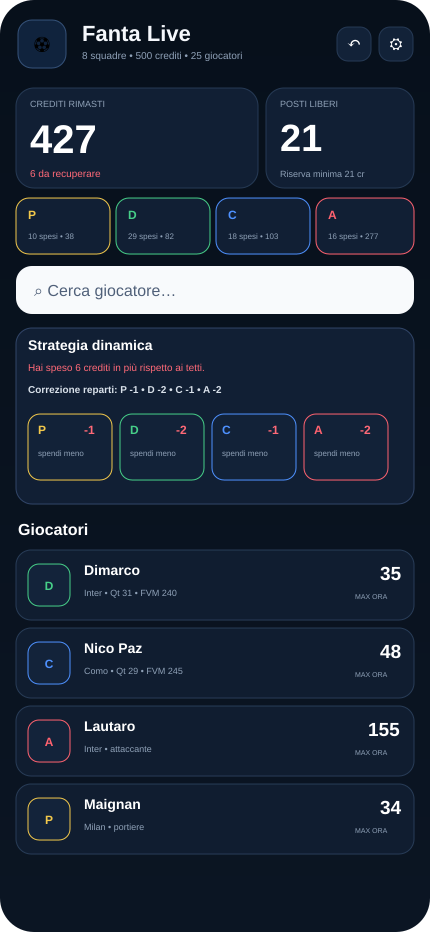

# ⚽ Fanta Live

<p align="center">
  
</p>

**Fanta Live** è una web app gratuita pensata per accompagnarti durante l'asta del Fantacalcio e durante l'**asta di riparazione**: cerca i giocatori, registra gli acquisti e lascia che l'app ricalcoli in tempo reale budget, hard stop, crediti residui e potere d'acquisto della lega.

👉 **App pubblica:** https://garruk929.github.io/Fanta/

## Anteprima

<p align="center">
  
</p>

## Due modalità

La navigazione è divisa in due ambienti separati tramite la tab bar in basso:

- **⚡ Asta** — asta iniziale, budget dinamico e costruzione rosa
- **🛠️ Riparazione** — svincolati, crediti delle squadre, acquisti e potere d'acquisto

I dati delle due modalità sono salvati separatamente: azzerare la riparazione non cancella l'asta iniziale.

## Funzioni principali

### Asta

- configurazione iniziale di **crediti, numero squadre e slot P/D/C/A**
- ricerca rapida del listone
- **hard stop dinamico** per ogni giocatore
- strategia che si adatta dopo ogni acquisto:
  - quanto hai speso/risparmiato rispetto al piano
  - quanti crediti togliere o aggiungere a P, D, C e A
  - budget consigliato residuo per ogni reparto
- gestione **Preso da me / Preso da un altro**
- rosa ordinata per ruolo e prezzo pagato
- indicazione di rigoristi, indisponibilità e profilo tecnico
- alternative immediate per ruolo
- undo dell'ultima operazione
- backup/import dell'asta dalle Impostazioni

### Riparazione

- interfaccia dedicata con background viola/bordeaux
- colori ruolo coerenti con l'asta principale:
  - **P** giallo
  - **D** verde
  - **C** blu
  - **A** rosso
- cruscotto P/D/C/A con conteggio degli svincolati disponibili
- import di file `.fclist`, JSON, CSV e TXT
- import di **squadre + crediti residui**
- supporto a snapshot JSON della risposta squadre di Leghe Fantacalcio
- calcolo automatico degli svincolati partendo dalle rose già occupate
- classifica live del potere d'acquisto delle squadre
- tetto consigliato per ogni svincolato
- registrazione acquisto con squadra e prezzo
- aggiornamento automatico dei crediti residui
- storico movimenti con undo

Dettagli tecnici sull'import: [docs/leghe-import.md](docs/leghe-import.md).

## Come usarla

1. Apri **https://garruk929.github.io/Fanta/**.
2. Scegli **Asta** o **Riparazione** dalla barra in basso.
3. In Asta imposta budget, numero di squadre e slot per ruolo.
4. In Riparazione importa svincolati e dati della lega oppure inserisci manualmente le squadre.
5. Durante l'asta apri un giocatore, registra l'acquisto e lascia che Fanta Live aggiorni i calcoli.

### Installazione su iPhone/iPad

Apri l'app in **Safari** → **Condividi** → **Aggiungi alla schermata Home**.

Non serve installare nulla da App Store.

## Strategia dinamica

Il motore dell'asta iniziale parte da una distribuzione del budget per ruolo e misura, dopo ogni acquisto, il delta tra il prezzo pagato e il tetto previsto.

Se spendi più del previsto, il deficit viene distribuito sui reparti ancora aperti; se risparmi, il margine viene redistribuito. L'app mostra sia la correzione complessiva per reparto sia l'effetto sul prossimo hard stop.

La modalità Riparazione usa invece i crediti residui reali della lega per confrontare il tuo potere d'acquisto con quello degli avversari.

> È uno strumento di supporto: non sostituisce le tue valutazioni, le regole specifiche della lega o le notizie dell'ultimo minuto.

## Dati e fonti

Il listone utilizzato dall'app è mantenuto nel file `players.csv` del repository. All'apertura Fanta Live prova a leggere la versione più recente e invalida la cache al cambio di stagione.

Per campioncini e alcune informazioni sportive possono essere consultate fonti pubbliche esterne, tra cui **Fantacalcio.it**. Informazioni come infortuni, gerarchie e rigoristi possono cambiare rapidamente e vanno considerate indicative.

L'import Leghe è **file-based e read-only**: Fanta Live non effettua login su Leghe Fantacalcio e non richiede né salva Bearer token o altre credenziali.

Fanta Live è un progetto indipendente e **non è affiliato** a Fantacalcio.it, Leghe Fantacalcio, Serie A o alle società calcistiche.

## Privacy

- nessun account obbligatorio
- nessun database utenti di Fanta Live
- rosa, prezzi, budget e impostazioni vengono salvati nel `localStorage` del browser
- i dati della Riparazione usano una chiave locale separata
- il backup è un file JSON esportato volontariamente dall'utente
- eventuali file importati vengono letti localmente dal browser
- richieste verso fonti esterne possono trasmettere a tali servizi i normali dati tecnici di una richiesta web, come IP e user-agent

Per eliminare i dati dell'asta basta usare **Impostazioni → Azzera asta**; per la riparazione usa **Squadre → Azzera solo riparazione**.

## Struttura del progetto

```text
.
├── index.html
├── app.js
├── repair.js
├── photo-fix.js
├── style.css
├── repair.css
├── v2.css
├── players.csv
├── manifest.webmanifest
├── sw.js
├── apple-touch-icon.png
├── favicon.png
├── assets/
│   └── fanta-live-icon.png
├── docs/
│   ├── preview.svg
│   └── leghe-import.md
└── LICENSE
```

## Contribuire

Bug, correzioni del listone e proposte di miglioramento sono benvenuti tramite **Issue** o **Pull Request** su GitHub.

Se segnali un dato sportivo errato, indica possibilmente una fonte e la data di verifica.

## Licenza

Il **codice originale del progetto** è distribuito con licenza [MIT](LICENSE).

La licenza MIT non concede diritti su nomi, marchi, immagini, loghi o dati appartenenti a terzi eventualmente visualizzati o richiamati dall'app.

---

**Fanta Live 2.1.0** · Bid. Build. Win.
